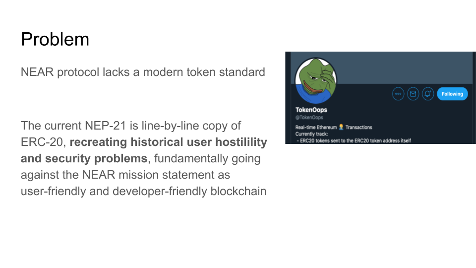
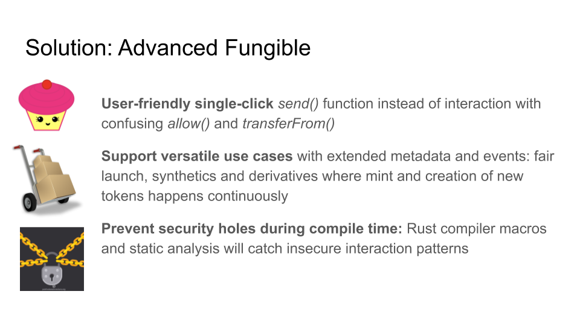
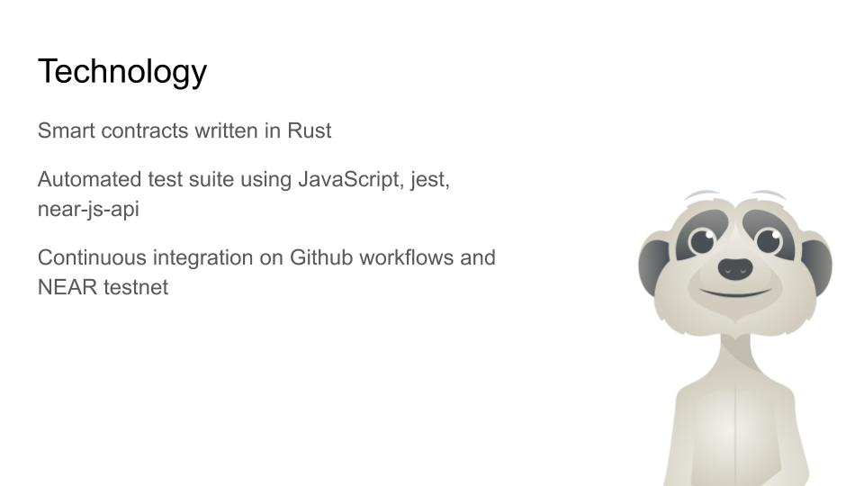
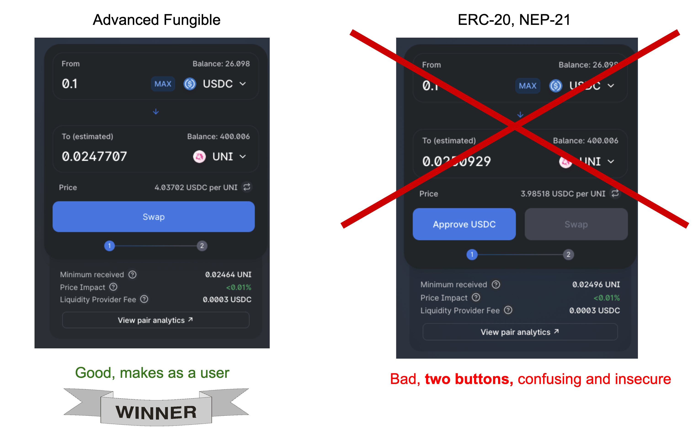

Advanced Fungible

**Advanced Fungible is a modern, secure and user friendly token standard for NEAR protocol**


# Overview

Open source contracts for a golden token standard for NEAR protocol

# Rainbow hackathon presention

[](http://www.youtube.com/watch?v=iOBxgXtoOJ8 "Rainbow Hackathon presentation")

[Watch 2 minutes presentatoin on YouTube](http://www.youtube.com/watch?v=iOBxgXtoOJ8)

# Walkthrough









# Benefits



* Slick user and developer experience with single transaction `send()` vs. `approve()` and `transferFrom()`

* Security primitives to safely interact with tokens on the NEAR sharded blockchain and promises

* A lot of code examples

Part of Rainbow hackathon: https://gitcoin.co/hackathon/hack-the-rainbow/projects/1497/Advanced-Fungible-Token-Standard-NEP-9000

## How does it work

There are two main functions

- `Token.send()` for sending tokens to users and smart contracts

- `Receiver.on_received()` for receiving tokens on smart contracts and taking any action on an incoming transfer

Each cross-shard transaction in NEAR is a promise. When multiple smart contracts
interact with each other, promises are chained. The ledger
locks up any tokens that are "in transit" so that they cannot be double spent,
or subject to anything equal to Ethereum re-entrancy attack.
In the case the promise chain fails, any locked up transactions
are rolled back and balances restored to the point before the promise chain was started.

# Technology

* Smart contracts written in Rust

* Automated test suite using JavaScript, jest, near-js-api

* Continuous integration on [Github workflows](https://github.com/miohtama/advanced-fungible/actions) and NEAR testnet

## Development

Below is how to build and run tests.

```sh

# Install rust
brew install rustup
rustup update

# Build and execute contract unit tests
cd contracts
cargo build
cargo test

# Build and execute contract acceptance tests
cd ..
yarn install
yarn jest
```

### Running a single test

Example

```sh
npx jest src/token.test.js
```

## Visual Studio Code

Install Rust extension. Choose *Start Rust Server* from the command palette.

## Test cases

JavaScript test cases are written with Jest and a custom runner
that uses https://rpc.ci-testnet.near.org chain.

# Challenges

NEAR protocol is advertised developer-friendly, but currently the state of the matter is that this statement
is mostly inspirational. A lot of toolchain design mistakes, brokeness and lack of documentation held
back the development.

- The lack of notion that two contracts may be actually needed and they may interact through all the toolchain.
  Maybe this was simplification or oversight in the original design decisions, but means anything NEAR
  is not useful for any serious smart contract development.

- These is zero information how to set up repeatable local net for integration testing

- `create-near-app` is hardcoded for a single contract, both JavaScript codebase and Rust codebase.

- Rust unit tests cannot test contract interactions.

- Contracts are defined in Rust as libraries instead of binaries what they are,
  making dealing with multiple contracts even more difficult and semantically incorrect.

- A broken simulation tests suite exists, but is undocumented, way too difficult to use and
  does not support contract interactions.

- There is no concept of ABI files, all contract interfaces must be re-described in JavaScript by hand.

- near-js-api does not document how to interact with contracts https://near.github.io/near-api-js/modules/_contract_.html

- near-js-api test helpers are not reusable, a copy-paste test utility suite had to be created.

- Manually specifying gas amounts in contract calls is cumbersome https://github.com/near/core-contracts/blob/master/lockup/src/owner_callbacks.rs#L330

- Documentation (https://docs.near.org/docs/development/calling-smart-contracts) and code examples (near-js-api) are not cross referenced, making it very hard to navigate and figure out
  up-to-date documentation.

- Need an explorer for CI transactions

- Promise parameter serialisation to JSON is painful - amounts

# Further reading

Some other code examples:

https://docs.near.org/docs/development/calling-smart-contracts

https://github.com/near/near-sdk-rs/blob/master/examples/fungible-token/src/lib.rs

https://github.com/near/core-contracts/tree/master/lockup/src

https://stevedonovan.github.io/rust-gentle-intro/object-orientation.html

https://github.com/near-examples/simulation-testing

https://github.com/near-examples/guest-book/tree/master

https://github.com/smartcontractkit/near-protocol-contracts


